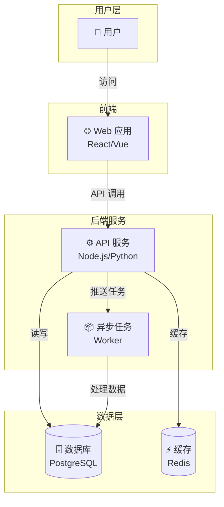
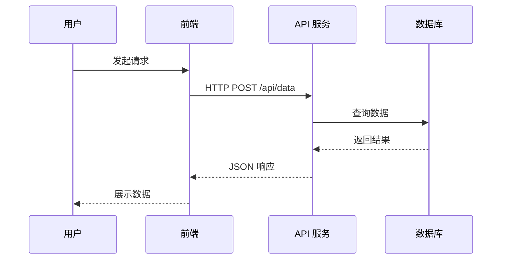
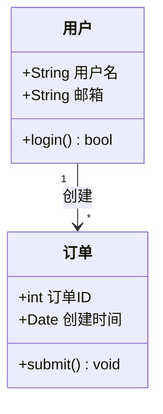
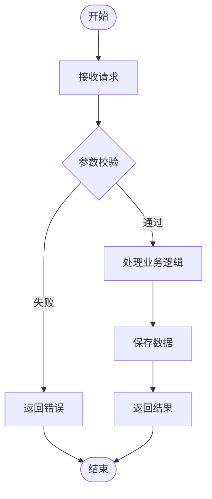
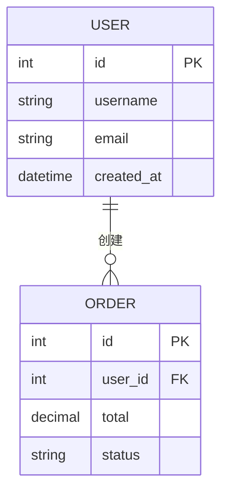
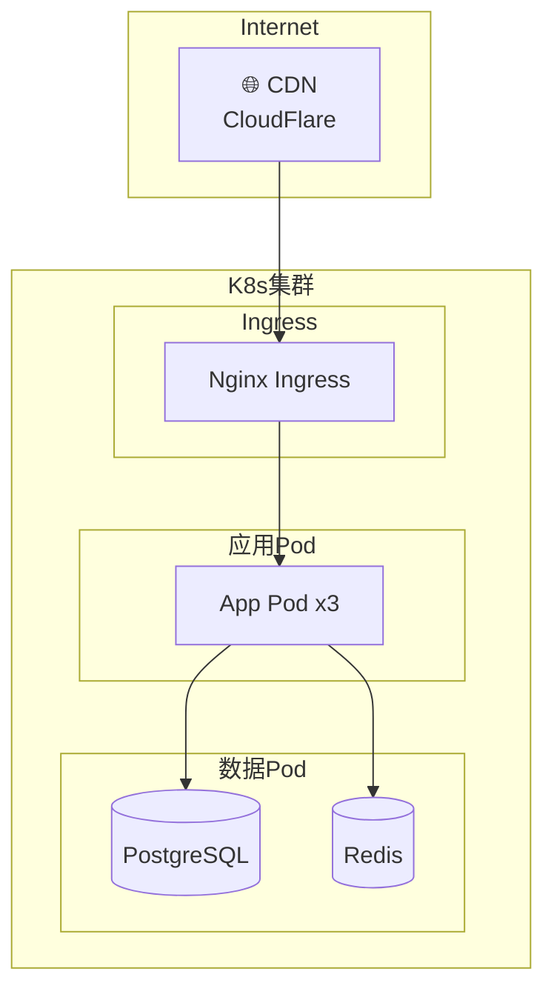

# 系统架构图生成器

根据代码仓库自动分析或自然语言描述，生成 Mermaid 格式的架构图。

## 工作流程

按以下 4 个阶段执行：

---

### 阶段 1: 确定图表类型和范围

**目标**: 明确用户需要什么类型的图表，以及分析范围

1. **解析用户意图**：从用户消息中提取：
   - 图表类型（如果明确指定）
   - 分析范围（整个项目 / 特定模块 / 特定功能）
   - 特殊要求（关注点、详略程度）

2. **如果用户未指定图表类型**，扫描项目后根据代码特征自动推荐：

   | 代码特征 | 推荐图表 |
   |---------|---------|
   | 多个服务/模块、微服务架构、monorepo | 系统架构图 (C4) |
   | REST/GraphQL API、多组件交互 | 序列图 |
   | OOP 代码、类继承/组合 | 类图 |
   | 业务逻辑、状态流转、审批流程 | 流程图 |
   | 数据库 Schema、ORM Model 定义 | ER 图 |
   | Docker/K8s/Terraform 配置 | 部署图 |

3. **如果代码和描述都不足以判断**，使用 AskUserQuestion 询问用户想要哪种图表类型。

**支持的图表类型及 Mermaid 语法**：

- **系统架构图**: `graph TD` 或 `C4Context`（使用 C4 扩展语法）
- **序列图**: `sequenceDiagram`
- **类图**: `classDiagram`
- **流程图**: `flowchart TD`（推荐用 `flowchart` 代替 `graph`）
- **ER 图**: `erDiagram`
- **部署图**: `graph TD`（用子图表示节点/集群）

---

### 阶段 2: 代码分析

**目标**: 扫描项目结构，提取生成图表所需的信息

#### 2.1 项目结构扫描

1. 列出顶层目录结构：
   ```bash
   find . -maxdepth 3 -type f | head -100
   ```

2. 识别项目类型和技术栈：
   - 包管理文件：`package.json`, `requirements.txt`, `go.mod`, `pom.xml`, `Cargo.toml` 等
   - 框架配置：`next.config.js`, `vite.config.ts`, `django settings`, `spring application.yml` 等
   - 基础设施：`Dockerfile`, `docker-compose.yml`, `k8s/`, `terraform/` 等

3. 读取关键配置文件获取依赖和模块信息。

#### 2.2 根据图表类型进行针对性分析

**系统架构图 (C4)**：
- 识别系统边界（前端、后端、数据库、外部服务）
- 扫描 API 路由和服务入口
- 分析模块间依赖（import/require 关系）
- 识别外部集成（第三方 API、消息队列、缓存）
- 检查 `docker-compose.yml` 了解服务拓扑

**序列图**：
- 追踪请求处理流程（从路由到 Controller 到 Service 到 DB）
- 分析中间件/拦截器链
- 识别异步消息传递（事件、消息队列）
- 扫描 API 调用（HTTP Client、gRPC）

**类图**：
- 扫描类/接口定义
- 分析继承关系（extends/implements）
- 识别组合/聚合关系（成员变量类型）
- 提取关键方法签名
- **限制**：仅展示核心类（最多 15-20 个），省略工具类和 DTO

**流程图**：
- 识别业务入口函数
- 追踪条件分支（if/else、switch）
- 识别循环和递归
- 标注关键决策点

**ER 图**：
- 扫描 ORM Model / Schema 定义
- 识别字段名、类型、约束
- 分析外键和关联关系（一对一、一对多、多对多）
- 检查数据库迁移文件

**部署图**：
- 解析 Dockerfile 和 docker-compose.yml
- 分析 K8s manifests（Deployment、Service、Ingress）
- 识别网络拓扑（端口映射、服务发现）
- 检查 CI/CD 配置

#### 2.3 复杂度控制

- **节点上限**: 单张图表最多 20 个节点。超出时按模块分层，生成多张图。
- **关系简化**: 省略间接依赖，只展示直接关系。
- **分层策略**: 大型项目先生成高层概览图（L1），再根据需要细化子模块图（L2）。

---

### 阶段 3: 生成 Mermaid 图表

**目标**: 生成规范、可渲染的 Mermaid 代码

#### 3.1 图表生成规范

**通用规范**：
- 节点 ID 使用英文（如 `frontend`, `apiServer`）
- 节点标签使用中文（如 `["前端应用"]`）
- 连线标签使用中文简短描述（如 `-->|"HTTP 请求"|`）
- 添加清晰的注释说明图表内容

**各类型模板**：

##### 系统架构图 (C4 风格)


##### 序列图


##### 类图


##### 流程图


##### ER 图


##### 部署图


#### 3.2 输出格式

生成的文件为 Markdown 格式，结构如下：

```markdown
# [项目名] - [图表类型]

> 自动生成于 YYYY-MM-DD，基于代码分析

## 概述

[1-2 句话描述这张图表展示的内容]

## 架构图

[Mermaid 代码块]

## 组件说明

| 组件 | 说明 | 技术栈 |
|------|------|--------|
| ... | ... | ... |

## 关键交互

- [交互1 的简要说明]
- [交互2 的简要说明]
```

---

### 阶段 4: 输出和迭代

**目标**: 展示结果，支持用户调整

1. **展示图表**：
   - 在回复中直接展示 Mermaid 代码块（支持预览的环境会自动渲染）
   - 简要说明图表内容和关键发现

2. **保存文件**：
   - 默认保存到 `docs/diagrams/[图表类型].md`
   - 如果用户指定了路径，保存到指定位置
   - 询问用户是否需要保存

3. **迭代优化**：
   - 询问用户是否需要调整：
     - 增加/删除节点
     - 修改关系描述
     - 调整布局方向（TD/LR/BT/RL）
     - 细化某个子模块
     - 生成其他类型的图表
   - 根据反馈修改并重新展示

4. **多图生成**：
   - 如果项目较大，主动提议生成多层图表：
     - L1: 系统全景图（高层概览）
     - L2: 模块详情图（特定子系统）
   - 各图表独立保存，互相引用

---

## 质量检查清单

生成图表前，检查以下项目：

- [ ] Mermaid 语法正确，无拼写错误
- [ ] 节点 ID 唯一，无冲突
- [ ] 所有节点都有连线（无孤立节点）
- [ ] 中文标签无乱码
- [ ] 节点数量不超过 20 个（单图）
- [ ] 关系方向正确（数据流向/调用方向）
- [ ] 子图分组合理
- [ ] 图表能在 Mermaid Live Editor 正常渲染

---

## 注意事项

1. **Mermaid 语法兼容性**：
   - 避免使用实验性语法（如 C4 扩展在部分平台不支持）
   - 优先使用 `flowchart` 代替 `graph`（更好的功能支持）
   - 节点标签中的特殊字符需要用引号包裹

2. **大型项目策略**：
   - 不要试图在一张图中展示所有内容
   - 先概览后细化，逐层展开
   - 每张图聚焦一个主题

3. **标签语言**：
   - 节点标签和连线标签默认使用中文
   - 节点 ID 始终使用英文
   - 如果用户使用英文提问，标签也使用英文
